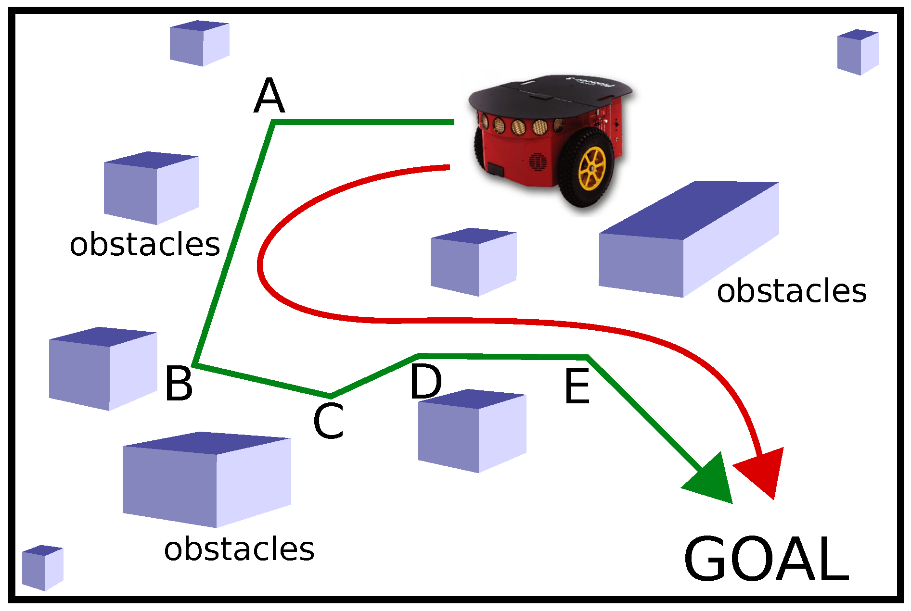

# Robot Navigation with TD3 using ROS Noetic

Author: Mohamed Ifqir

## Overview

This repository hosts code and resources essential for executing robot navigation using the TD3 algorithm within the ROS Noetic framework. TD3, a reinforcement learning algorithm, is utilized to control robot motion within a simulated environment.

The project heavily relies on ROS Noetic, a widely-used framework for constructing robotic systems, and harnesses the PyTorch library to implement the TD3 algorithm.

## Requirements

- **ROS Noetic:** Install ROS Noetic on your system. You can find detailed installation instructions in the [ROS Installation Guide](http://wiki.ros.org/noetic/Installation).

- **Python 3:** Ensure that Python 3 is installed on your system.

- **PyTorch:** Install PyTorch by following the guidelines provided on the [official website](https://pytorch.org/).